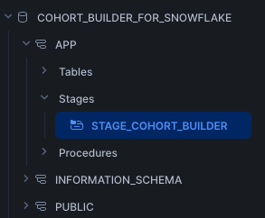
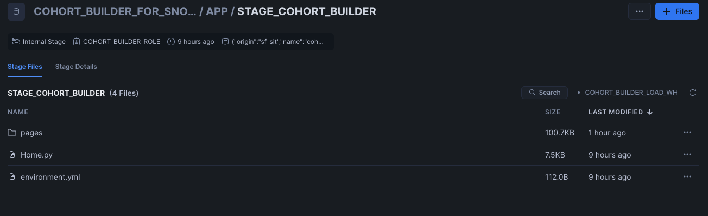

# Cohort Builder for Snowflake

The Cohort Builder solution provides a method for creating and managing cohorts through a Streamlit application, utilizing Snowflake and Snowpark.

All sample code is provided for reference purposes only. Please note that this code is provided “AS IS” and without warranty. Snowflake will not offer any support for use of the sample code.

Copyright (c) 2024 Snowflake Inc. All Rights Reserved.

Please see TAGGING.md for details on object comments.

## Overview

The Cohort Builder Model leverages Snowflake and Snowpark to create, manage, and schedule cohorts effectively.

A cohort is a group of subjects that share a common characteristic or experience within a defined period. This tool allows users to build cohorts based on specific criteria, manage existing cohorts, and schedule cohort updates.

**Cohort building** involves defining the criteria for inclusion in a cohort.
**Cohort management** includes updating and maintaining cohorts over time.
**Cohort scheduling** ensures that cohorts are refreshed at specified intervals to include the latest data.

## Problem(s) to be Solved

The Cohort Builder is designed to assist businesses and analysts in creating precise groupings of data subjects based on specific characteristics or behaviors. The application allows for:

- **Defining Cohorts** - Specify criteria for cohort membership using SQL queries.
- **Managing Cohorts** - Update and maintain existing cohorts to ensure data accuracy.
- **Scheduling Cohorts** - Automate the refreshing of cohorts at regular intervals using Snowflake dynamic tables, tasks and procedures.

## Functionalities

The Cohort Builder application offers three primary functionalities:

1. **Cohort Building** - Users can define cohort criteria through an intuitive interface that generates the necessary SQL queries.
2. **Cohort Management** - Provides tools for updating and managing cohorts to keep them current and relevant.
3. **Cohort Scheduling** - Allows users to set up automated tasks to refresh cohort data at specified cadences (e.g., hourly, daily, weekly, monthly).

## Takeaways

The Cohort Builder simplifies the process of cohort creation and management, ensuring that businesses can efficiently group data subjects and maintain up-to-date cohorts. By automating cohort updates, businesses can save time and reduce the risk of using outdated data.

The model assumes that the criteria for cohort inclusion are well-defined and that all necessary data is available in Snowflake. Properly setting up and managing these cohorts can lead to better data-driven decision-making.

## Example Use Cases

1. **Marketing Campaigns** - Create cohorts based on customer purchase behavior to target specific groups for marketing campaigns.
2. **Product Development** - Group users by usage patterns to identify potential improvements or new features.
3. **Healthcare** - Segment patients by treatment types or outcomes to study the effectiveness of medical interventions.

## Directions

1. Run `sql/app_setup.sql` as `ACCOUNTADMIN` in your Snowflake account.
2. In Snowsight, set your role to `COHORT_BUILDER_ROLE`, navigate to Databases on the left-hand bar, and select `COHORT_BUILDER_FOR_SNOWFLAKE`.
3. Select `APP` Schema, Open `Stages` and select the stage `STAGE_COHORT_BUILDER`.

4. Select the `cohort_builder_load_wh` warehouse.
5. Click on `+ Files` and upload the necessary files and folders from the GIT Repo. Your Stage should look like this.

4. Navigate to Projects on the left-hand bar, and select Streamlit.
3. Select `COHORT_BUILDER` in your list of Streamlit Apps.
4. Follow in-app instructions to build, manage, and schedule your cohorts.

By following these steps, users can leverage the power of Snowflake and Snowpark to create and maintain effective cohorts tailored to their specific needs.
